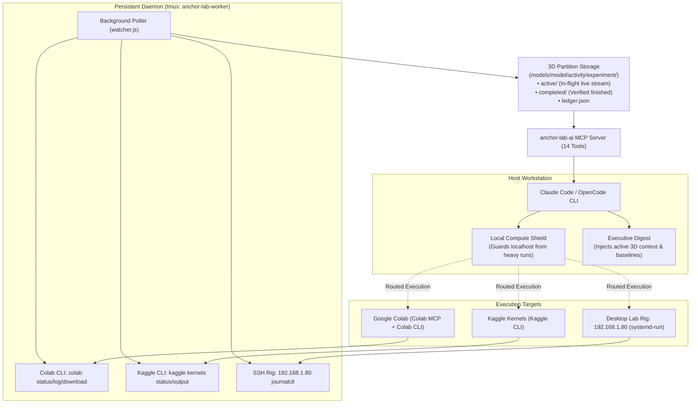

# ⚓ Anchor-Lab-Ai

> **Autonomous AI Laboratory Manager, Universal Model Context Protocol (MCP) Server & Claude Code Plugin tailored for multi-system LLM training, quantization research labs, and distributed compute.**

[](LICENSE)
[](https://claude.ai)
[](https://modelcontextprotocol.io)
[](https://github.com/tmux/tmux)

---

## 🚀 Overview

Modern AI research spans fragmented infrastructure: local development workstations, Google Colab notebooks, Kaggle GPU clusters, remote SSH training rigs, and API providers. When working with AI coding agents, agents often:
- Crash the host laptop by attempting heavy training jobs locally.
- Lose track of past test results, leading to forgotten baselines and repeated failures.
- Lack visibility into in-flight background training runs.
- Produce unreadable visualizations that fail accessibility standards or chromatic contrast.

**Anchor-Lab-Ai** solves this by establishing an autonomous, persistent laboratory anchor that acts as the operating system for your AI research.

---

## 🏛️ System Architecture



---

## ⚡ Core Capabilities

### 1. Intelligent 6-Type Graph Engine
The engine automatically detects the mathematical shape of your data and generates clean, eye-friendly ASCII terminal charts and vector SVG plots:
- **Line Convergence Curves** (`/anchorgraph loss`): Sequential loss decay & step progression.
- **Horizontal Ranking Bars** (`/anchorgraph rank`): Perplexity leaderboards & benchmark comparisons.
- **Grouped Multi-Metric Bars** (`/anchorgraph grouped`): Side-by-side metric comparisons across runs.
- **Pareto Trade-Off Scatters** (`/anchorgraph pareto`): 2D trade-off plots (e.g. Precision Bits vs Perplexity with Pareto frontier).
- **Proportional Donut Charts** (`/anchorgraph trits`): Categorical distributions (e.g. Base-3 Trit balance `{-1, 0, +1}` or sparsity).
- **Radar Spider Fingerprints** (`/anchorgraph radar`): Multi-axis model capability profiles.

### 2. Local Compute Shield
Guards the local workstation against GPU Out-of-Memory (OOM) crashes, swap thrashing, and disk overflow. Heavy training runs are intercepted via hooks and routed to Colab, Kaggle, or the desktop rig.

### 3. 3D Workspace Partitioning
Strictly organizes experiments across a 3D coordinate space:
```text
models/
  └── <model>/           (e.g., qwen2.5-0.5b)
        └── <activity>/  (training | quantization | evaluation | experiment)
              └── <experiment>/
                    ├── active/          (In-flight runs & live streams)
                    ├── completed/       (Verified finishes & safetensors)
                    └── ledger.json      (Validated benchmark metrics)
```

### 4. Historical Archeologist & Synthesizer
Performs whole-project scans across past session transcripts and synthesizes findings into an **isolated historical archive**:
- `HISTORICAL_DOSSIER.md`: Architectures explored and validated leaderboards.
- `FAILURE_GRAVEYARD.md`: Documented hardware, kernel, and dtype traps with actionable mitigations.
- `HISTORICAL_LEADERBOARD.json`: Ranked empirical results kept isolated so legacy runs never contaminate new benchmarks.

### 5. Multi-Model Advisory Research Council
Convenes external models (Luna, Nemotron, AGY) for literature review and formulation of smoke test proposals. Council agents are **strictly advisory** with zero file-modification permissions.

### 6. Persistent Watcher Daemon
Runs inside a dedicated, self-healing `tmux` session (`anchor-lab-worker`) to watch remote runs, parse live step sentinels (`__ANCHOR_STEP__`), update ledgers, and alert the agent.

---

## 🎮 Claude Code Slash Commands

| Slash Command | Description |
| :--- | :--- |
| `/anchor` | Run full compute fleet audit, check `tmux` host, and show active 3D context |
| `/anchorsetup` | Harvester model switcher wizard (Luna, OpenRouter `:free`, AGY) |
| `/anchorscan` | Whole-project historical scan -> builds isolated historical dossier |
| `/anchorsweep <query>` | Targeted search across past session transcripts (5-hour quota guarded) |
| `/anchorgraph [query]` | Intelligent multi-type graph generator (Line, Bars, Grouped, Pareto, Donut, Radar) |
| `/anchorgraphlive` | Toggle real-time live graph streaming for in-flight training (ON/OFF) |
| `/researchpaper` | Synthesize an academic research paper in NeurIPS/ArXiv format |
| `/anchorcouncil <topic>` | Convene multi-model advisory subagents (strictly zero code edits) |
| `/anchorhelp` | Complete laboratory command directory & cheat sheet |

---

## 🛠️ Terminal CLI Utilities

```bash
# Health, fleet, and hardware audit
anchor-lab-ai doctor

# Active context & in-flight runs
anchor-lab-ai status

# Switch harvester worker model
anchor-lab-ai model openai/gpt-5.6-luna

# Background watcher daemon management
anchor-lab-ai start    # Launch in background tmux session
anchor-lab-ai attach   # View live streaming daemon logs
anchor-lab-ai stop     # Terminate background watcher

# Historical scan & retrieval
anchor-lab-ai scan
anchor-lab-ai sweep "learning rate warmup"

# Intelligent visualization
anchor-lab-ai graph pareto
anchor-lab-ai graph trits
anchor-lab-ai graphlive

# Research paper & council
anchor-lab-ai paper
anchor-lab-ai council "Hadamard vs Random Orthogonal rotations"
```

---

## 🔌 Universal MCP Server (14 Tools)

Anchor-Lab-Ai exposes a standard Model Context Protocol (MCP) server:

1. `lab_get_state`: Inspect in-flight runs, active model & baseline references.
2. `lab_set_context`: Switch 3D focus (`model`, `activity`, `experiment`).
3. `lab_calc_vram`: Pre-run VRAM budget estimator (prevents OOM crashes).
4. `lab_verify_safetensor`: Bit-exact zero-float audit for integer containers.
5. `lab_scan_run_health`: Silent failure detector (NaN loss, zero gradients, dead loops).
6. `lab_remote_poll`: Poll live status of Colab, Kaggle, or SSH rig jobs.
7. `lab_remote_fetch_logs`: Pull unbuffered execution logs or download checkpoints.
8. `lab_remote_colab_dispatch`: Execute detached Python jobs on Colab VMs.
9. `lab_get_logger_template`: Unbuffered streaming logger boilerplate.
10. `lab_get_container_spec`: Lookup integer container packing specifications.
11. `lab_get_test_report`: Retrieve isolated benchmark tables.
12. `lab_reconcile_memory`: 3-way delta: recalled assumptions vs actual code vs ledger.
13. `lab_deep_sweep`: Historical transcript search with 5-hour quota protection.
14. `lab_get_morning_handoff`: 4-bullet morning resume card after late-night runs.

---

## 📦 Installation & Setup

```bash
# 1. Clone the repository
git clone https://github.com/CodeMasterCody3D/anchor-lab-ai.git
cd anchor-lab-ai

# 2. Run the automated installer
chmod +x install.sh
./install.sh

# 3. Verify installation
anchor-lab-ai doctor
```

---

## 📄 License

MIT License. Copyright (c) 2026 Cody Dixon.
